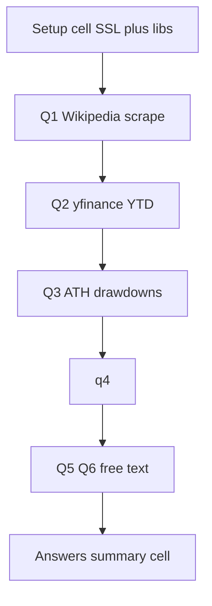

# 2026 Homework 1 Implementation Plan

Save location (raw): [cohorts/2026/HW1/guide/homework1-plan.md](homework1-plan.md)

Spec: [cohorts/2026/homework1.md](../../homework1.md)

Reuse TLS/import setup from [01-intro-and-data-sources/[2026]_Module_01_Colab_Introduction_and_Data_Sources.ipynb](../../../01-intro-and-data-sources/[2026]_Module_01_Colab_Introduction_and_Data_Sources.ipynb): `truststore.inject_into_ssl()` before HTTPS, then `yfinance` / `requests`.

**Deliverable:** new notebook `cohorts/2026/HW1/homework1.ipynb` (one section per question) plus a short answers cell/block for the submission form: https://courses.datatalks.club/sma-zoomcamp-2026/homework/hw01

## Files

- Create folder `cohorts/2026/HW1/`
- Write raw plan: `cohorts/2026/HW1/guide/homework1-plan.md` (this document, unrendered/raw markdown)
- Create `cohorts/2026/HW1/homework1.ipynb`
- Do not commit data CSVs

## Setup cell (first code cell)

```python
%pip install yfinance pandas lxml beautifulsoup4 requests truststore

import truststore
truststore.inject_into_ssl()

import requests
import pandas as pd
import numpy as np
import yfinance as yf
from io import StringIO
from datetime import date
```

Reuse Wikipedia User-Agent from the homework spec.

## Q1 — S&P 500 additions (required)

**Answer:** year with most additions among full years `>= 2020`.

Steps:
1. `GET` https://en.wikipedia.org/wiki/List_of_S%26P_500_companies with the given User-Agent.
2. `pd.read_html(StringIO(response.text))` — first table is current constituents (`Symbol`, `Security`, `Date added`).
3. Parse `Date added` to datetime; extract year. Rows with missing dates = original members, skip for yearly counts.
4. `value_counts()` on year, filter `year >= 2020`, take `idxmax()`.
5. Additional (not the form answer): count tickers with `Date added <= today - 20 years` (or year `<= current_year - 20`).

Pitfall: Wikipedia may 403 without headers. Do not count 1957 founding as a 2020+ year.

## Q2 — World indexes YTD vs S&P 500 (required)

**Answer:** integer count of indexes (out of 10 non-US) with YTD return **greater than** `^GSPC` as of 21 Aug 2026.

Tickers: `^GSPC`, `000001.SS`, `^HSI`, `^AXJO`, `^NSEI`, `^GSPTSE`, `^GDAXI`, `^FTSE`, `^N225`, `^MXX`, `^BVSP`.

YTD: `Close_end / Close_start - 1` using **closing prices**. yfinance `end` is exclusive → download `start="2026-01-01"`, `end="2026-08-22"` so 21 Aug is included. If 1 Jan is a holiday, use first available close in range; last available close `<= 2026-08-21`.

Additional: same vs S&P over 3y / 5y / 10y windows ending 2026-08-21. Ignore FX.

## Q3 — S&P 500 corrections, median drawdown % (required)

**Answer:** median drawdown **in percent** for corrections with drawdown `>= 5%`.

Algorithm:
1. `yf.download("^GSPC", start="1950-01-01")` daily Close.
2. ATH days: `close > close.cummax().shift(1)` (price exceeds all previous closes).
3. For each consecutive ATH pair `(t_i, t_{i+1})`, `low = close[t_i:t_{i+1}].min()` (include trough between highs).
4. `drawdown_pct = (high - low) / high * 100`.
5. Keep `drawdown_pct >= 5`. Duration = calendar days `trough_date - ath_date` (or days to next ATH — validate against hint table).
6. Report p25, **p50 (median)**, p75 for durations **and** drawdowns. Submission uses **median drawdown**.

Validate top-10 against the spec list (e.g. 2007-10-09 → 2009-03-09 ~56.8% / 517d). If dates off by 1, check whether trough day is inclusive and whether Close vs Adj Close was used — **use Close**.

## Q4 — AMZN earnings surprise 2-day return (required)

**Answer:** median 2-day return after **positive** Surprise %.

1. `yf.Ticker("AMZN").get_earnings_dates()` — expect ~25 rows from `2020-10-29`; drop the future row with NaN Reported EPS / Surprise %.
2. Download full AMZN daily history.
3. For every 3 consecutive **trading** days `(d1, d2, d3)`: `ret = Close[d3] / Close[d1] - 1`. Align earnings to `d2` (announcement day). If earnings timestamp is after close, still map to that session date via timezone-naive date join.
4. Filter `Surprise % > 0`. Median of those 2-day returns.
5. `pd.corr()` between 2-day return and Surprise % (additional: all surprises, not only positive).

## Q5–Q6 — optional free text

Q5: capstone idea (specific asset, horizon, features). Can reuse earlier direction: multi-source (yfinance + FRED + one non-lecture source) for US large-cap, week-ahead direction.

Q6: 2–4 extra series + why + how to pull in Python (e.g. FRED `VIXCLS`/`T10Y2Y`, AMZN `get_earnings_dates`, Wikipedia sector dummies). Keep short.

## Execution order



## Submit

Fill https://courses.datatalks.club/sma-zoomcamp-2026/homework/hw01 with Q1 year, Q2 count, Q3 median drawdown, Q4 median 2-day return, plus optional Q5/Q6 text.
